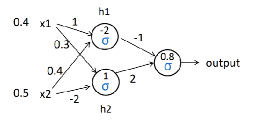

# Week-Eleven-Homework-Repository
This is a repository dedicated to storing code that has been taken from homework  eleven, which can be meant for future reference

## Assignment 14: Neural Network

Consider the following two layer neural network with sigmoid activation function. Note that each circle node applies the sigmoid function,
and the number inside a circle indicates a bias for the node. If the input <0.4, 0.5> presented, what would be the output?

